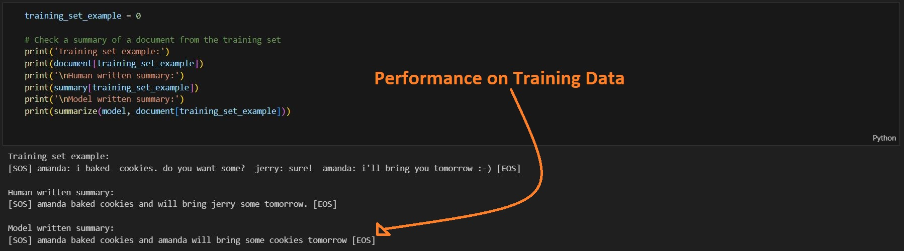
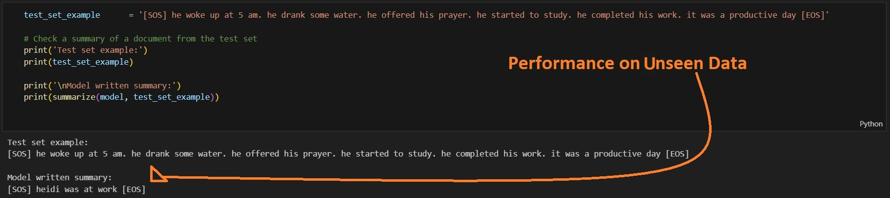

## Building a Transformer from Scratch for Text Summarization  
### Based on the [Natural Language Processing Specialization](https://www.deeplearning.ai/courses/natural-language-processing-specialization/) by [DeepLearning.ai](https://www.deeplearning.ai)  
#### Course 4 – Week 2  

📘 **Full Specialization GitHub Repo:** [Natural Language Processing from Scratch](https://github.com/AnsImran/natural_language_processing_from_scratch) 
##### (Explore all the skills I’ve learned throughout this specialization)

---
## Results

---
# [Table of Contents](https://github.com/AnsImran/Transformer_from_Scratch_for_Text_Summarization/blob/master/Transformer_from_Scratch_for_Text_Summarization_(PyTorch_Implementation).ipynb)

### 1. Data Processing
- Loading
- Preprocessing
- Tokenization
- Padding
- Generator

### 2. Useful Functions
- Positional Encoding
- Padding Mask
- Look Ahead Mask

### 3. Transformer (Encoder-Decoder)
- Encoder Layer
  - MultiHead Self-Attention
  - Residual Connection & Batch Normalization
  - Feed Forward Neural Network
  - Residual Connection & Batch Normalization
- Full Encoder
  - Embedding Layer
  - Positional Encoding
  - Dropout Layer
  - Encoder LayerS
- Decoder Layer
  - Masked MultiHead Self-Attention (Causal Attention)
  - Residual Connection & Batch Normalization
  - MultiHead Attention
  - Residual Connection & Batch Normalization
  - Feed Forward Neural Network
  - Residual Connection & Batch Normalization
- Full Decoder
  - Embedding Layer
  - Positional Encoding
  - Dropout Layer
  - Decoder layerS
- Full TRANSFORMER
  - Encoder + Decoder + Linear Layer
  - Log Softmax
### 4. Training Loop
- Epochs, Learning Rate, Batch Size and Pad-Index
- Loss Function
- Optimizer
- Computing Loss
- Predictions
- Clearing Gradients
- Updating Weights
### 5. Inference
- Next Word Prediction Function
- Summarization Function
### 6. Conclusion
- Some Remarks on Results
---

