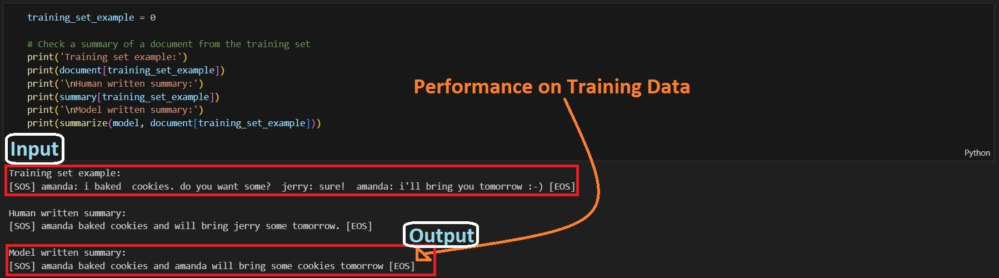
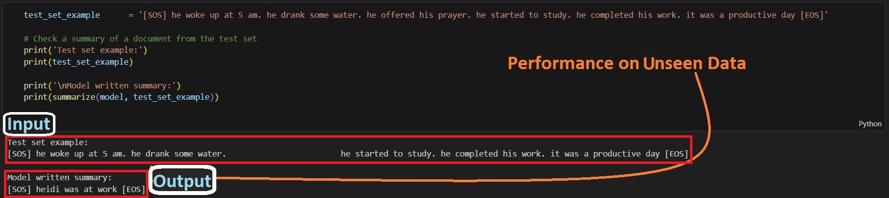

# Building a Transformer from Scratch for Text Summarization  
### Based on the [Natural Language Processing Specialization](https://www.deeplearning.ai/courses/natural-language-processing-specialization/) by [DeepLearning.ai](https://www.deeplearning.ai)  
#### Course 4 – Week 2  

📘 **Full Specialization GitHub Repo:** [Natural Language Processing from Scratch](https://github.com/AnsImran/natural_language_processing_from_scratch) 
##### (Explore all the skills I’ve learned throughout this specialization)

---
## Results

